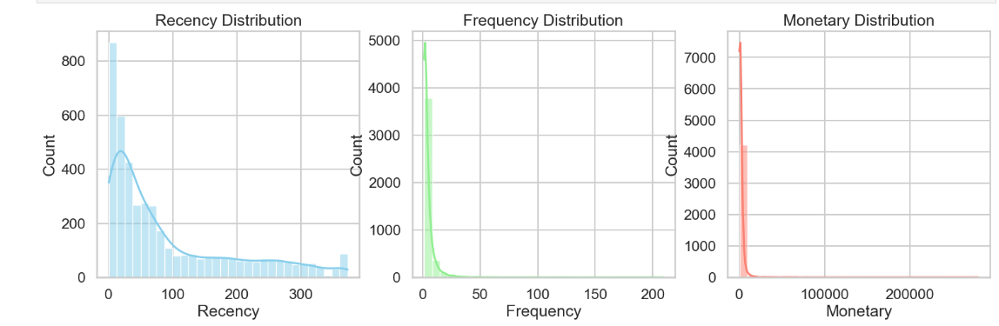
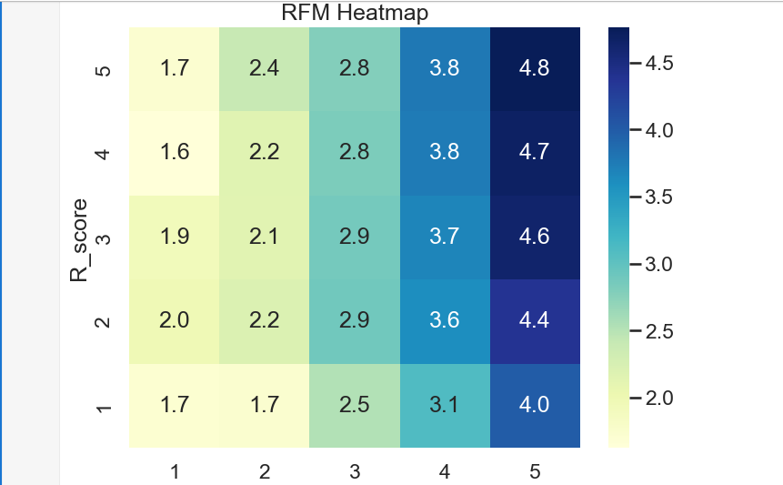
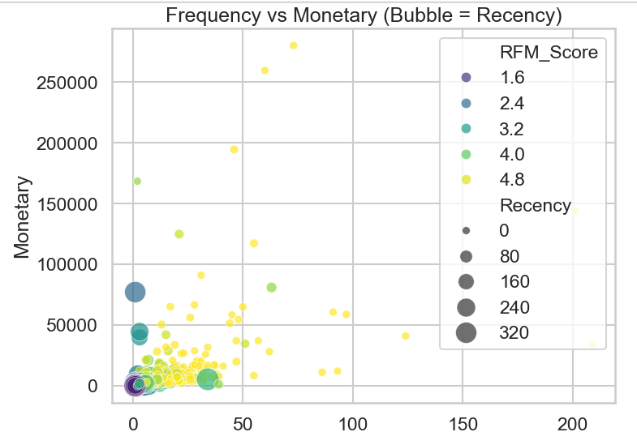
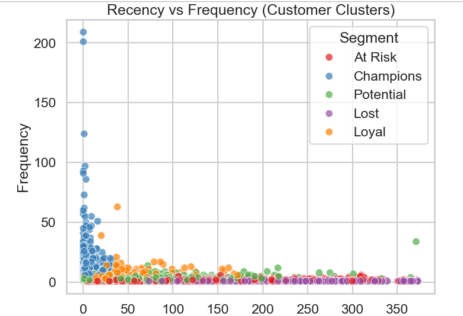
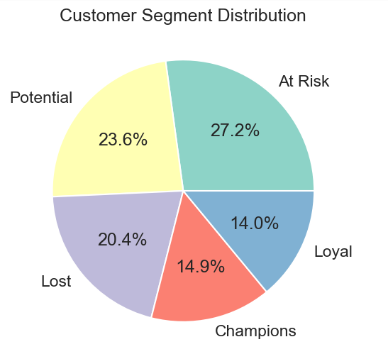

# 🛍️ Customer Segmentation with RFM Analysis  

## Overview  
This project performs **RFM (Recency, Frequency, Monetary) analysis** on customer transaction data to identify different customer segments.  
The goal is to help businesses improve **customer retention, marketing strategies, and revenue growth** by targeting the right groups.  

### Dataset
This analysis uses the **Online Retail dataset**.  
You can download it from [UCI Machine Learning Repository](https://archive.ics.uci.edu/ml/datasets/online+retail).

## Key Steps  
1. Data Cleaning & Preprocessing  
2. RFM Metric Calculation (Recency, Frequency, Monetary)  
3. Customer Segmentation based on RFM scores  
4. Data Visualization & Insights  

## Insights  
- 📉 Most customers purchase **infrequently** and have low spending.  
- 💎 A small group of **loyal/high-value customers** contribute the most revenue.  
- ⚠️ **At-risk customers** (high Recency, low Frequency) need re-engagement campaigns.  
- 🎯 Businesses should **focus on Champions & Potential Loyalists** for best ROI.  

## Visualizations  

### 1. Recency, Frequency, Monetary Distributions  
  

### 2. RFM Heatmap  
  

### 3. Frequency vs Monetary (Bubble = Recency)  
  

### 4. Recency vs Frequency (Clusters)  
  

### 5. Customer Segment Pie Chart  
  

### 6. Customer Segment Countplot  
  

## Tech Stack  
- **Python**: Pandas, NumPy  
- **Visualization**: Matplotlib, Seaborn  
- **Environment**: Jupyter Notebook  

## How to Run Locally  
1. Clone the repository:  
   ```bash
   git clone https://github.com/Mominaaah/RFM-Analysis.git
   cd RFM_Analysis

